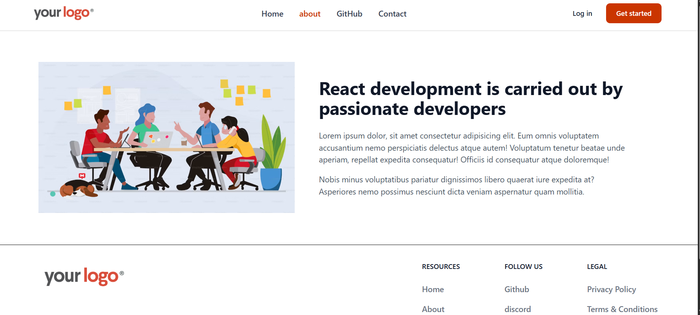
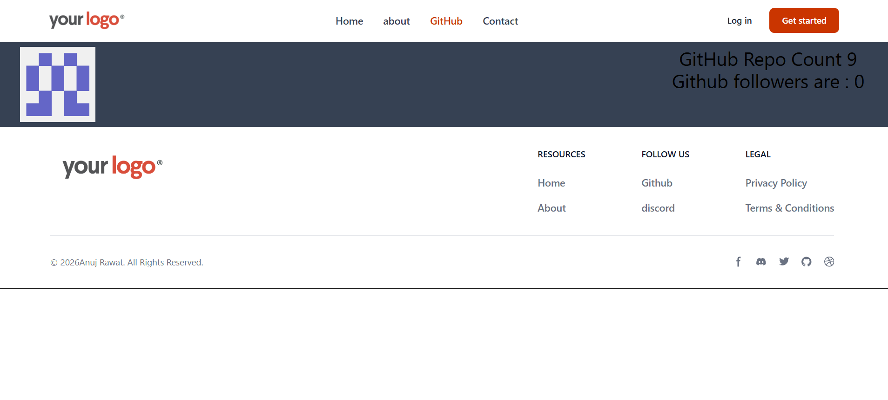

# 🚀 React Router Project

A React project built to learn and practice **React Router DOM**, routing, dynamic routes, route loaders, API integration, and reusable components.

## 🛠️ Tech Stack

- React
- React Router DOM
- JavaScript
- Axios
- Tailwind CSS
- Vite

## ✨ Features

- 🏠 Home, About, Contact and GitHub pages
- 🔗 Navigation using `Link` and `NavLink`
- 🧭 Nested routing with `Outlet`
- 🔀 Dynamic routes with `useParams`
- 📦 Route loaders with `useLoaderData`
- 🐙 GitHub API integration using Axios
- 🧩 Reusable Header and Footer components
- 📁 Centralized component exports using `index.js`
- 🎨 Responsive UI using Tailwind CSS

## 🧭 Routes

| Route | Page |
|---|---|
| `/` | Home |
| `/about` | About |
| `/contact` | Contact |
| `/github` | GitHub |
| `/:id` | Dynamic Route |
| `/user/:userId` | User Route |

## 🐙 GitHub API

The GitHub page fetches user information from the GitHub API and displays:

- Profile image
- Public repository count
- Followers

The API data is loaded using a React Router **loader** and accessed using `useLoaderData()`.

## 📁 Project Structure

```text
src/
├── components/
│   ├── about/
│   ├── contact/
│   ├── footer/
│   ├── github/
│   ├── header/
│   ├── home/
│   ├── random/
│   ├── user/
│   └── index.js
│
├── Layout.jsx
├── App.jsx
├── main.jsx
└── index.css


## 📸 Screenshots

### Home Page
## 📸 Screenshot




### About Page


### GitHub Page

