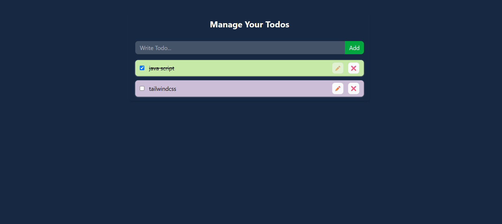

# 📝 Todo App — React Context API + Local Storage

A Todo application built with **React** to practice **Context API, React Hooks, Local Storage, reusable components, and CRUD operations**.

The application allows users to add, update, delete, and mark todos as completed. Todo data is stored in **Local Storage**, so the todos remain available even after refreshing the page.

---

## 🚀 Features

* ➕ Add new todos
* ✏️ Update existing todos
* 🗑️ Delete todos
* ✅ Mark todos as completed/uncompleted
* 💾 Save todos in Local Storage
* 🔄 Restore todos after page refresh
* 🌐 Manage global state using Context API
* 🧩 Reusable React components
* 📱 Responsive UI
* 🎨 Styled with Tailwind CSS

---

## 🛠️ Tech Stack

* **React**
* **JavaScript**
* **Context API**
* **React Hooks**

  * `useState`
  * `useEffect`
  * `useContext`
* **Local Storage**
* **Tailwind CSS**
* **Vite**


The application will be available at the local development URL provided by Vite.

---

## 🧠 Concepts Practiced

### 1. Context API

The Todo state and Todo functions are shared between components using React Context API.

The context provides:

```text
todos
addToDo()
updateToDo()
deleteToDo()
toggleComplete()
```

This avoids passing the same data through multiple levels of props.

---

### 2. useState

`useState` is used to maintain the Todo list.

```js
const [todos, setTodos] = useState([]);
```

---

### 3. Adding a Todo

A new Todo is added using the previous state.

```js
setTodos((prev) => [
    ...prev,
    {
        id: Date.now(),
        ...todo
    }
]);
```

The spread operator creates a new array instead of modifying the existing state directly.

---

### 4. Updating a Todo

`map()` is used to find the Todo with the matching ID and replace it.

```js
setTodos((prev) =>
    prev.map((elem) =>
        elem.id === id ? todo : elem
    )
);
```

---

### 5. Deleting a Todo

`filter()` creates a new array without the Todo whose ID matches.

```js
setTodos((prev) =>
    prev.filter((elem) => elem.id !== id)
);
```

---

### 6. Toggle Completed Status

The completed value is changed from `true` to `false` or from `false` to `true`.

```js
setTodos((prev) =>
    prev.map((elem) =>
        elem.id === id
            ? {
                ...elem,
                completed: !elem.completed
            }
            : elem
    )
);
```

---

## 💾 Local Storage

The Todo list is saved in the browser's Local Storage.

Before storing the array, it is converted into a JSON string:

```js
localStorage.setItem(
    "todosKey",
    JSON.stringify(todos)
);
```

When the application starts, the stored JSON string is converted back into a JavaScript array:

```js
const todosLocalStorage = JSON.parse(
    localStorage.getItem("todosKey")
);
```

This allows the Todo data to remain available after refreshing the browser.

---

## 🔄 Data Flow

```text
                    App
                     │
                     ▼
             TodoContextProvider
                     │
          ┌──────────┴──────────┐
          ▼                     ▼
      TodoForm              TodoItem
          │                     │
          └──────────┬──────────┘
                     ▼
               Todo Context
                     │
                     ▼
                 todos state
                     │
                     ▼
               Local Storage
```

---

## 📸 Project Preview

Add your screenshot here:





## 🎯 What I Learned

Through this project, I practiced:

* Managing global state with Context API
* Creating reusable components
* Using `useState` for state management
* Using `useEffect` for side effects
* Using `useContext` to consume context
* Working with Local Storage
* Performing CRUD operations
* Using `map()` to update array items
* Using `filter()` to remove array items
* Using the spread operator to create new arrays/objects
* Managing state without directly mutating existing state

---


